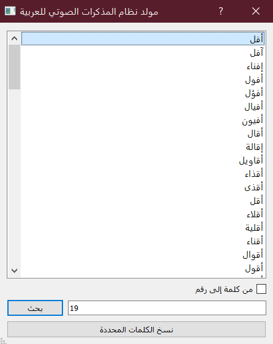
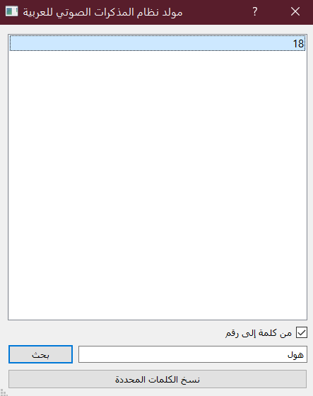

# نظام المذكرات الصوتي للعربية

هذا تطبيق لنظام المذكرات الصوتي ([Mnemonic major system](https://en.wikipedia.org/wiki/Mnemonic_major_system)) للغة العربية،
مع إضافة لبرنامج [أنكي](https://apps.ankiweb.net/).

## مقدمة

يستخدم هذا النظام لتسهيل تذكر الأرقام والتواريخ، حيث يتم تشكيل جدول يُربَط فيه
بين كل رقم وعدد من أحرف الأبجدية.
يكون هذا الربط عادة مبنيًا على علاقات سهلة التذكر بين الرقم وهذه الأحرف.
يتم بعدها تحويل الرقم المراد تذكره إلى كلمة أو كلمات سهلة التذكر ولها علاقة بالعدد حسب هذا الجدول.

لنأخذ مثالًا عمليًا لتوضيح الفكرة:

لنقل أن لدينا الجدول التالي (وهو المستخدم في هذا البرنامج):

ونريد تذكر تاريخ نهاية الحرب العالمية الأولى (1918 م).

سنحول كل منزلتين من التاريخ إلى كلمة ذات دلالة حسب الجدول.

لنبدأ بـ19: بالاستعانة بالجدول يمكننا أن نحصل على كلمات ذات صلة مثل فنى، فناء.

بتحويل العدد 18 نحصل على كلمات مثل هول، أهوال.

(لاحظ كيف تجاهلنا أحرف مثل ا، أ، و، ء لكثرة تكرارها).

بالربط بين هاتين الكلمتين، يمكن أن نأتي بجملة قصيرة قد تساعد على تذكر التاريخ:
«أ**فن**ت الحرب العالمية الأولى حياة الكثيرين وكانت **أهوال**ها عظيمة.»

يمكننا بالطبع أن نقسم العدد إلى أجزاء مختلفة كيفما شئنا ونحاول إيجاد كلمات مقابلة،
مثل أن نأخذ العدد كاملًا (1918) ونحاول إيجاد كلمة واحدة مقابلة له،
لكن بعض التركيبات تعطي كلمات أدل من تركيبات أخرى، وبعضها قد لا يعطي شيئًا.
لك أن تقسم العدد كيفما شئت لإيجاد الدلالات الأنسب.

مهمة هذا البرنامج هي تسهيل إيجاد الكلمات، لكنه لن يكون مفيدًا كثيرًا
إذا لم تكن قد حفظت الجدول عن ظهر قلب.
لكن لحسن الحظ، الجدول صغير وهو أيضًا مبني غالبًا على دلالات سهلة التذكر بين كل
رقم ومجموعة حروف.

## استخدام البرنامج

البرنامج مخصص بشكل رئيسي للاستخدام مع برنامح أنكي كإضافة.

يمكن الوصول إلى الإضافة من القائمة الرئيسية في أنكي تحت قائمة أدوات.

كما أن للإضافة أيقونة في محرر الملحوظات تفتح الواجهة مع تحديد النص المحدد
حاليًا في المحرر والبحث عن كلمات مقابلة له (إذا كان يحتوي على أرقام)،
أو تحويل كلمة إلى قيمتها العددية.

## مراجع

- الجدول المستخدم في البرنامج مأخوذ من كتاب [الأسماء كلها](https://t.me/Asmaae_Kollaha).
أنصح بقرأة الكتاب للاطلاع أكثر على هذه التقنية وتقنيات مفيدة أخرى.

- قائمة الكلمات العربية أغلبها مأخوذ من مشروع [معجم الراموز الوسيط](http://arramooz.sourceforge.net/).

